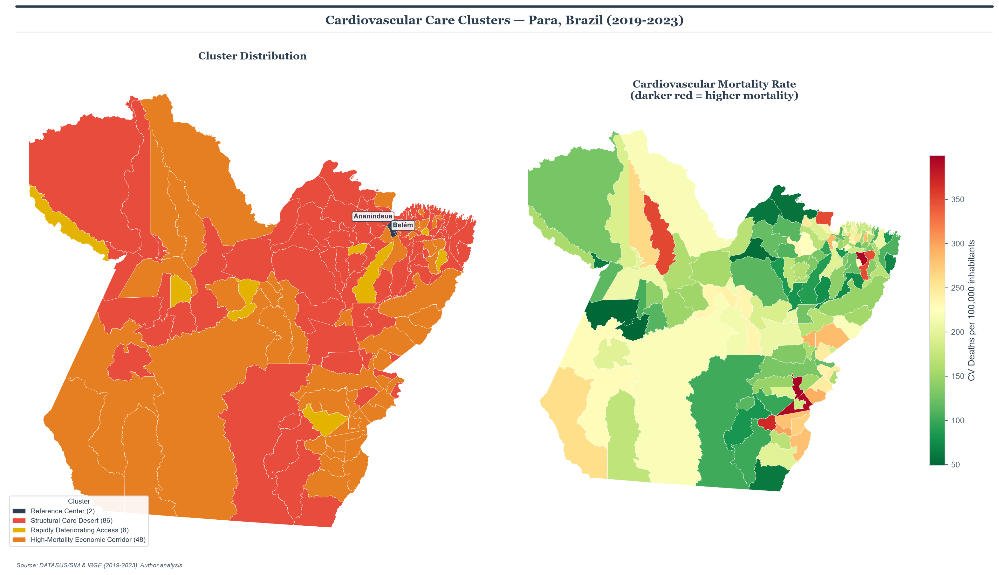
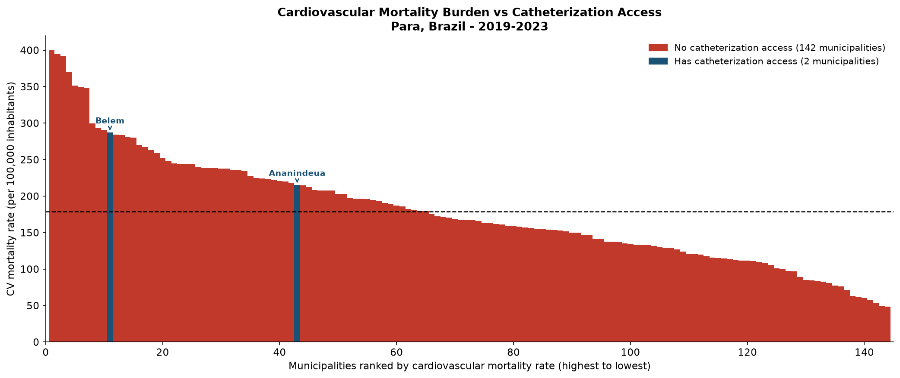
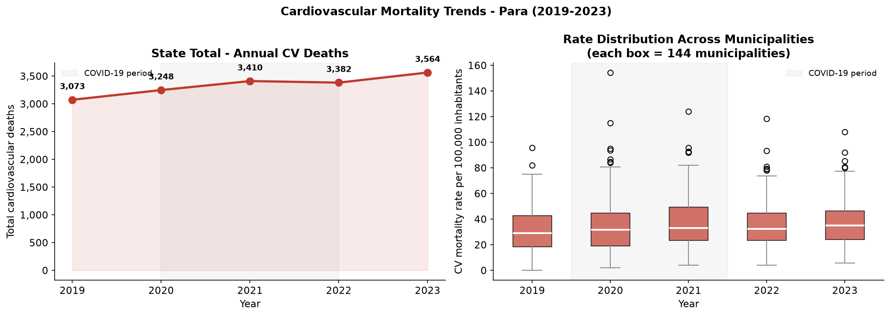

# Cardiovascular Care Deserts in Pará, Brazil
### A Clustering Analysis of Regional Health Disparities (2019–2023)

[](.)
[](.)
[](LICENSE)
[](https://doi.org/10.17605/OSF.IO/UK7EM)

---

## Overview

In Pará, Brazil — a state of 8.1 million people spanning 1.25 million km² — cardiac catheterization was performed in **only 2 out of 144 municipalities** between 2019 and 2023. This project applies K-Means clustering to public health data from DATASUS and IBGE to characterize the structural heterogeneity of cardiovascular care access and mortality burden across the state's municipalities.

**Central finding:** Two municipalities (Belém and Ananindeua) concentrated 100% of the 5,324 cardiac catheterization procedures recorded over the study period. The remaining 142 municipalities — with 16,677 cardiovascular deaths — recorded zero.

---

## Key Figures

### Geographic Distribution of Cardiovascular Care Clusters



*Left: K-Means cluster assignments across 144 municipalities. Right: cardiovascular mortality rate choropleth. Reference centers (Belém and Ananindeua) outlined in navy.*

---

### Mortality Burden vs. Catheterization Access



*All 144 municipalities ranked by cardiovascular mortality rate. Red bars = no catheterization access (142 municipalities). Navy bars = municipalities with catheterization infrastructure.*

---

### Temporal Trends (2019–2023)



*Left: state-level cardiovascular deaths by year. Right: distribution of per-municipality mortality rates. COVID-19 disruption period shaded.*

---

## Research Question

*Do cardiovascular mortality rates, procedure access, and socioeconomic indicators define structurally distinct profiles among municipalities in Pará, Brazil between 2019 and 2023?*

---

## Methods

**Data sources**

| Source | Variables | Coverage |
|---|---|---|
| DATASUS / SIM | Cardiovascular mortality (ICD-10 I20–I25) | Pará, 2019–2023 |
| DATASUS / SIH-SUS | Cardiac catheterization procedures (AIH) | Pará, 2019–2023 |
| IBGE Table 6579 | Municipal population estimates | Pará, 2021 (baseline) |
| IBGE GDP series | Municipal gross domestic product | Pará, 2019–2023 |
| IBGE Geociências | Municipal boundary polygons | Pará, 2022 |

**Pipeline**
```
Raw DATASUS/IBGE exports
→ Cleaning & encoding standardization (latin-1, utf-8-sig)
→ Name normalization & cross-source linkage
→ Feature engineering (rates per 100k, GDP per capita, smoothed growth trend)
→ Variance check → zero-variance exclusion of taxa_proc_100k
→ Log-transform GDP (right-skew, mining economies)
→ StandardScaler normalization
→ K-Means (k=4) + internal stability validation (ARI, 30 runs)
→ ANOVA cluster validation (F-statistics, p<0.001)
→ GeoPandas map visualization
```

**Cluster results**

| Cluster | Name | n | Mean mortality (per 100k) | Mean GDP per capita |
|---|---|---|---|---|
| 0 | High-Mortality Economic Corridor | 21 | 203.3 | R$693,864 |
| 1 | Rapidly Deteriorating Access | 18 | 159.5 | R$129,502 |
| 2 | Structural Care Desert | 67 | 129.8 | R$117,222 |
| 3 | Critical Mortality Burden | 36 | 260.7 | R$139,768 |
| — | Reference Centers (excluded) | 2 | — | — |

**Tools:** `Python 3.10` · `pandas` · `numpy` · `scikit-learn` · `scipy` · `geopandas` · `matplotlib` 

---

## Methodological Notes

- **Reference center exclusion:** Belém and Ananindeua were classified a priori as regional cardiac reference centers and excluded from clustering. Including them produced a trivial two-group solution driven by procedure volume rather than health profile heterogeneity.
- **Zero-variance exclusion:** `taxa_proc_100k` = 0 for all 142 clustered municipalities. A constant variable adds no information to K-Means distance calculations and was excluded from the model.
- **GDP log-transformation:** Applied prior to StandardScaler to address right skew driven by mineral extraction economies (Canaã dos Carajás GDP per capita: R$4.7M vs state median R$124k).
- **Smoothed growth trend:** Two-year block comparison with Laplace smoothing: `(mean_2022-2023 − mean_2019-2020) / (mean_2019-2020 + 1) × 100`

---

## Repository Structure

```
regional-health-disparities-brazil/
├── data/
│   └── processed/
│       ├── para_cardiovascular_clean.csv
│       ├── para_cardiovascular_clustered.csv
│       └── cluster_profiles.csv
├── notebooks/
│   ├── 01_data_cleaning.ipynb
│   ├── 02_eda.ipynb
│   ├── 03_clustering.ipynb
│   ├── 04_figure_styling.ipynb
│   └── figures/
│       ├── 02_procedure_concentration.png
│       ├── 03_mortality_distribution.png
│       ├── 04_temporal_trends.png
│       ├── 05_economic_gradient.png
│       ├── 06_access_gap.png
│       ├── 07_elbow_silhouette.png
│       ├── 08_cluster_profiles.png
│       └── 09_cluster_map.png
├── manuscript/
│   └── manuscript.docx
├── style.py
├── requirements.txt
└── README.md
```

---

## Reproducibility

```bash
git clone https://github.com/g4bfernandoo/regional-health-disparities-brazil.git
cd regional-health-disparities-brazil
pip install -r requirements.txt
```

Raw data files are not included (size). Follow the instructions in `data/raw/README.md` to download from DATASUS and IBGE. All data are publicly available under Brazil's Lei de Acesso à Informação (Law 12,527/2011).

Run notebooks in order: `01 → 02 → 03 → 04`

---

## Publication Status

`Under review` — *PLOS ONE* (PONE-D-26-35451) | Preprint: [OSF](https://doi.org/10.17605/OSF.IO/UK7EM)

---

## Author

**Gabriel Fernando**
· Prospective BME undergraduate researcher · Cardiovascular data science

[GitHub](https://github.com/g4bfernandoo) · [ORCID](https://orcid.org/0009-0003-6367-7000)

---

*Data: DATASUS (Ministério da Saúde) and IBGE. Publicly available under Lei nº 12.527/2011.*
